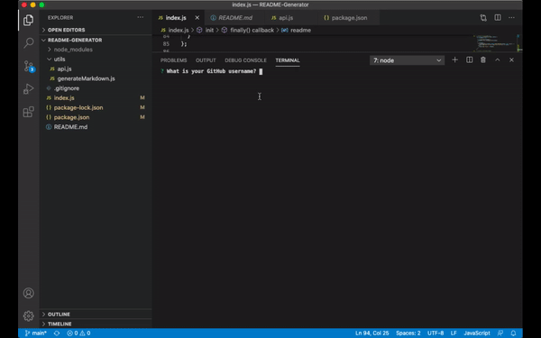

# README-Generator

A command-line application that dynamically generates a professional README.md from a user's input using the Inquirer package. 

## Table of Contents 
* [Installation](#installation) 
* [Badges](#badges) 
* [Usage](#usage) 
* [License](#license) 
* [Questions](#questions) 

## Installation 
 `npm install` 

## Badges 
 
 
 
 
 

## Usage 
 'npm install'
 `node index.js`
 
 

## License 
 None 

## Questions 
 (dit1091)  [dannettetejeda@gmail.com](mailto:dannettetejeda@gmail.com)
